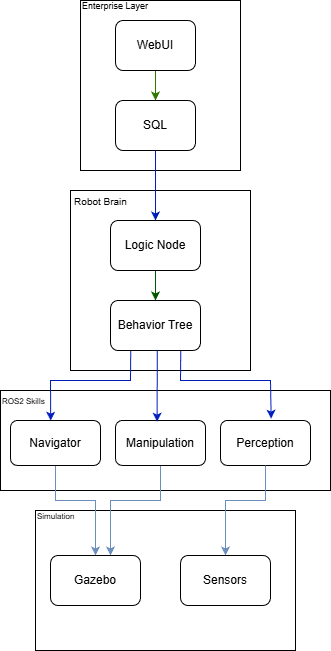
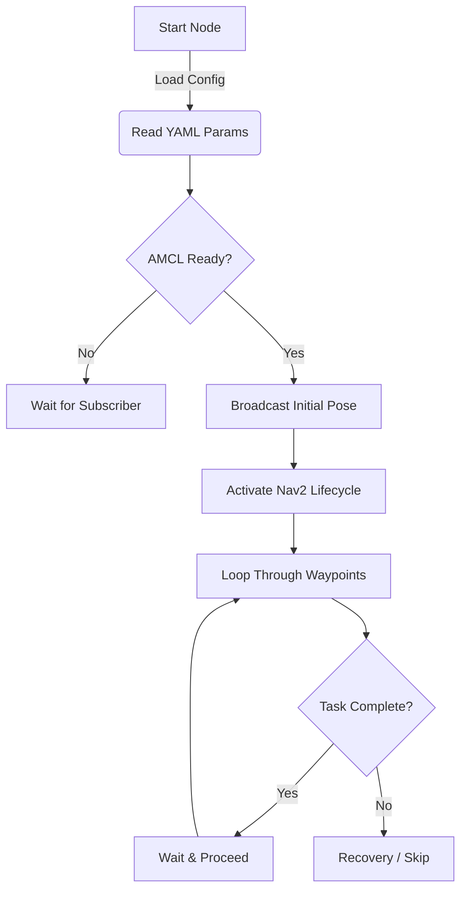

# Warehouse Bot Core - Autonomous Mobile Robot (AMR)

   

**Warehouse Bot Core** is a scalable and modular autonomous robot software architecture designed for industrial warehouse logistics.

The current phase of the project (**Phase 1**) focuses on continuous patrol, autonomous mapping, and localization capabilities in dynamic warehouse environments. The system is built on **ROS 2 Humble** using the **Nav2** stack and is managed by a deterministic State Machine.

<table style="width:100%">
  <tr>
    <th width="50%">Simulation Environment (Gazebo)</th>
  </tr>
  <tr>
    <td></td>
  </tr>
</table>

## System Architecture

The project features a multi-layered architecture that bridges **Enterprise Level Control** with **Low-Level Hardware Abstraction**.



The architecture consists of 4 main layers:
1.  **Enterprise Layer:** (Future) WebUI and SQL-based fleet management layer.
2.  **Robot Brain:** Decision support mechanism. Currently executed via a *Logic Node*, to be integrated with *Behavior Trees* in future iterations.
3.  **ROS2 Skills:** Modular services for Navigation, Manipulation, and Perception.
4.  **Simulation/Hardware:** Gazebo simulation or physical robot sensor interfaces.

## Technical Implementation

### 1. Robust Localization Handshake
To prevent "Race Condition" errors during AMCL (Adaptive Monte Carlo Localization) startup, a custom **Subscriber-Aware Initialization** algorithm has been developed. The robot does not broadcast its initial pose until it detects a subscriber listening to the `/initialpose` topic.

$$
P_{init} = \{x=0.0, y=0.0, \theta=0.0\}_{map}
$$

This process prevents Nav2 costmap layers (`static_layer`, `obstacle_layer`) from crashing before the TF tree (`map` -> `odom` -> `base_link`) is fully established.

### 2. Configuration Management
The robot's patrol route is completely decoupled from the source code. Coordinates are loaded dynamically in `YAML` format.

* **Config Path:** `src/warehouse_autonomy/config/patrol_config.yaml`
* **Structure:**
    ```yaml
    security_patrol_node:
      ros__parameters:
        waypoint__x: [1.45, -3.50, 5.63]
        waypoint__y: [6.64, -2.88, 2.07]
    ```

### 3. System Orchestration
All subsystems (Simulation, Navigation, Autonomy) are consolidated under a single `LaunchDescription`. A daisy-chain startup sequence is created using `TimerAction` to balance the processor load.

## 📥 Installation

### Prerequisites
The following system requirements must be met to run the project:
* **OS:** Ubuntu 22.04 LTS (Jammy Jellyfish)
* **Middleware:** ROS 2 Humble Hawksbill
* **Simulation:** Gazebo Classic
* **Language:** Python 3.10+

## Appendix: Sequential Logic Flow
The current security patrol (Phase 1) uses a sequential state logic as shown below:



### Clone Repository
Navigate to the `src` directory of your workspace and clone the project:

```bash
mkdir -p ~/robot_ws/src
cd ~/robot_ws/src
git clone [https://github.com/mertaren/warehouse_bot_core.git](https://github.com/mertaren/warehouse_bot_core.git)
```

### Install Dependencies

```bash
cd ~/robot_ws
rosdep install --from-paths src --ignore-src -r -y
```

### Part 2: Build Instructions

```markdown

## Build Instructions
Use the `colcon` tool to build the project. Symlink installation allows changes in Python files to take effect without recompiling.
```

1.  **Build the packages:**
```bash
cd ~/robot_ws
colcon build --packages-select warehouse_autonomy --symlink-install
```

2.  **Source the environment:**
You must run this command in every new terminal you open:
```bash
source install/setup.bash
 ```
## Usage

Launch the entire system (Gazebo, Nav2, Security Node) with a single command:

```bash
ros2 launch warehouse_autonomy start_all.launch.py
```

### Part 4: Roadmap & Footer

## Roadmap

- [x] **Phase 1: Navigation & Patrol Logic** (Current)
  - Master Launch file implementation.
  - Robust AMCL initialization.
  - YAML-based dynamic configuration.
- [ ] **Phase 2: Manipulation (MoveIt 2)**
  - Pick & Place pipeline implementation.
  - Integration of robotic arm URDF.
- [ ] **Phase 3: Behavior Trees (Groot)**
  - Migrating Python logic to XML-based Behavior Trees.
- [ ] **Phase 4: Enterprise Integration**
  - SQL Database connection for inventory tracking.
  - Web Interface for fleet control.


---
*Maintained by [Mert Aren](https://github.com/mertaren)*
